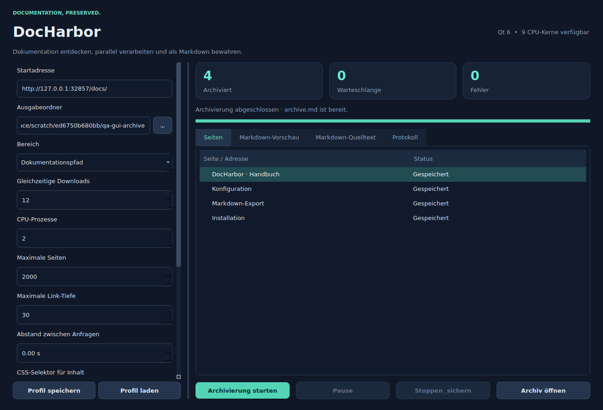

# Doku-crawler · DocHarbor

Eine Desktop-App für Linux und Windows, die Dokumentationsseiten crawlt und als Markdown archiviert. Native Qt-6-Oberfläche mit dunklem Design, Vorschau, Statusanzeigen und Profilen. Zusätzlich ist eine Kommandozeilenschnittstelle enthalten.



## Schnellstart

Python **3.11–3.14**, 64 Bit, wird für das Quellcodepaket benötigt. Python 3.12 ist die getestete Version. Für die optionale Browser-Erweiterung empfiehlt sich die Python-Version, für die Playwright auf deinem System Wheels bereitstellt.

### Linux (auch CachyOS)

ZIP entpacken, Terminal im Ordner `DocHarbor` öffnen:

```bash
bash run-linux.sh
```

Der erste Start erstellt eine isolierte Python-Umgebung und installiert die Abhängigkeiten. Internetzugang wird hierfür benötigt. Unter Debian/Ubuntu bei fehlendem venv: `sudo apt install python3-venv`. Unter CachyOS: `sudo pacman -S python python-pip`. Qt nutzt automatisch die verfügbare Plattform (Wayland oder X11). Falls die Wayland-Integration Probleme macht, kann `QT_QPA_PLATFORM=xcb bash run-linux.sh` verwendet werden. Dafür wird XWayland benötigt. Fehlende Qt-Systembibliotheken müssen über den Paketmanager installiert werden.

### Windows

Python 3.12 (64 Bit) inklusive Python Launcher installieren. ZIP vollständig entpacken und **run-windows.cmd** doppelklicken. Der erste Start installiert die Abhängigkeiten in `.venv`. Bei Installationsfehlern bleibt das Fenster offen.

### Portable Linux-Ausgabe

Falls du das separat angebotene Linux-Paket verwendest: Archiv entpacken, den vollständigen Ordner behalten und `DocHarbor/DocHarbor` ausführen. Python muss dabei nicht installiert sein. Bei Bedarf `chmod +x DocHarbor/DocHarbor`. Systembibliotheken für Qt und eine Desktop-Sitzung werden weiterhin benötigt. Dieser Build wurde in einer Linux-x86_64-Umgebung erzeugt; ältere Distributionen mit einer älteren glibc können inkompatibel sein. In diesem Fall die Quellcodeversion oder einen auf der eigenen Distribution erzeugten Build verwenden.

## Verwendung

1. Startadresse eintragen, z. B. `https://docs.example.org/guide/`.
2. Einen eigenen Ausgabeordner für dieses Dokumentationsarchiv wählen.
3. Crawl-Bereich wählen:
   - **Dokumentationspfad:** `.../guide/` bleibt unter `/guide/`. Bei `.../guide/start.html` gilt der übergeordnete Pfad `/guide/`. **Wichtig:** `.../guide` ohne abschließenden Slash wird als Seite im Wurzelverzeichnis verstanden; für den Unterbaum `/guide/` verwenden.
   - **Ganze Domain:** nur der exakte Host, keine Subdomains. HTTP und HTTPS auf demselben Host werden berücksichtigt.
   - **Nur diese Seite:** archiviert eine einzelne Seite, inklusive zulässiger Weiterleitung auf demselben Host.
4. CPU-Prozesse auf **Automatisch** lassen: alle für den Prozess verfügbaren CPU-Kerne. Downloads und Anfrageabstand separat einstellen.
5. **Archivierung starten**. Eine Seite auswählen, um Vorschau oder Markdown-Quelltext anzusehen.
6. **Archiv öffnen** öffnet den Ausgabeordner. Die gewünschte einzelne Gesamtdatei heißt **archive.md**.

Pause verhindert neue Seitenjobs; bereits laufende Seiten werden fertig verarbeitet. **Stoppen & sichern** beendet den Lauf und erstellt das bisherige Archiv. Auch beim Schließen des Fensters wird gespeichert. Das Speichern wartet auf bereits laufende HTML-Konvertierungen; bei großen Archiven kann es etwas dauern.

Für eine Wiederaufnahme dieselbe Startadresse, Bereich, CSS-Auswahl, Query-Option, Ausschlüsse und Browser-Einstellung mit demselben Ordner verwenden. Erfolgreiche Seiten werden nicht erneut heruntergeladen. Vorherige Fehler werden erneut versucht. Wenn das Seitenlimit erreicht wurde, kann es erhöht werden. Zur vollständigen Aktualisierung einen neuen Ordner wählen: die Wiederaufnahme ist kein Update-Crawl. Nach einem abrupten Prozessabbruch ist der letzte gespeicherte Zustand verfügbar; noch nicht im Zustand erfasste Seiten können erneut geladen werden.

## Archivdateien

| Datei / Ordner | Inhalt |
| --- | --- |
| `archive.md` | Eine Gesamtdatei mit Inhaltsverzeichnis, Quellen und allen eindeutigen Seiten |
| `index.md` | Verzeichnis der lokal verknüpften Markdown-Seiten |
| `pages/` | Einzelne Originalkonvertierungen mit Quellen- und Zeitstempel-Kommentar |
| `offline/` | Einzelne Markdown-Seiten mit lokal umgeschriebenen Links zu archivierten Seiten |
| `manifest.json` | Quellen, Status, Fehler, Wortzahlen, Inhalts-Hashes und Linkbeziehungen |
| `crawl-state.json` | Profil, Ergebnisse und Warteschlange für die Wiederaufnahme |

Die Ausgabe ist UTF-8. Dateinamen enthalten URL-Hashes, damit Sonderzeichen, Abfrageparameter und Windows-Dateinamensregeln nicht zu Kollisionen führen. Identische Markdown-Inhalte werden nur einmal gespeichert; URL-Aliase bleiben im Manifest erhalten. Im Gesamtarchiv verweisen Links auf die jeweilige Seite; Unterabschnittsfragmente sind dort auf den Seitenanker reduziert. Bei Einzeldateien bleiben Abschnittsfragmente erhalten; deren Darstellung hängt von der Ankerkonvention des Markdown-Viewers ab.

## Dokumentationsinhalte

Der Crawler entdeckt Links im gesamten Dokument, auch in Seitennavigationen. Für den Markdown-Inhalt bevorzugt er Docusaurus-, MkDocs-, Sphinx- und allgemeine `article`-/`main`-Bereiche. Navigation, Skripte, Formulare und Schaltflächen werden entfernt. Überschriften, Listen, Tabellen, Codeblöcke samt Sprachkennung, Links und Bilder werden konvertiert.

Bei ungewöhnlichem Layout einen **CSS-Selektor** für den gewünschten Bereich angeben, zum Beispiel `.documentation-body`. Fehlende Selektoren werden als Fehler protokolliert; die App exportiert dann nicht versehentlich die ganze Navigation.

**Ausschlüsse** sind reguläre Ausdrücke, z. B. `/search|/login|/print`. URL-Fragmente werden beim Crawling entfernt. Query-Parameter werden standardmäßig entfernt; bei Dokumentationen mit `?page=...` die Option **URL-Abfrageparameter behalten** einschalten. Tracking-Parameter werden auch dann entfernt. PDFs, ZIPs und andere Binärdateien werden nicht als Dokumentationsseiten verfolgt.

Bilder bleiben URLs zur Quelle; es ist **kein vollständiger Offline-Spiegel inklusive Bilder**. Es werden keine Login-Sitzungen, Cookies aus deinem Browser oder geschützte Nutzerbereiche importiert. Nicht verlinkte Inhalte ohne passende Sitemap können nicht entdeckt werden. Layouts mit Frames, Shadow DOM oder Navigation ausschließlich über JavaScript-Ereignisse erfordern ggf. Anpassungen.

## JavaScript-Seiten (optional)

In der Quellcodeversion einmal installieren:

Linux:
```bash
.venv/bin/python -m pip install -e '.[browser]'
.venv/bin/python -m playwright install chromium
```

Windows:
```powershell
.venv\Scripts\python.exe -m pip install -e ".[browser]"
.venv\Scripts\python.exe -m playwright install chromium
```

Dann **JavaScript rendern** aktivieren. Das HTML wird zuerst mit denselben Scope- und robots-Prüfungen heruntergeladen und anschließend in Chromium ausgeführt. Maximal vier Browser-Seiten parallel begrenzen den Speicherverbrauch; Markdown-Konvertierungen laufen weiter über den CPU-Prozesspool. Gleichnamige Host-Ressourcen für Scripts und Hydration dürfen geladen werden; externe Ressourcen und weitere Dokumentnavigationen werden blockiert. Dadurch können Seiten, die auf externe CDNs oder APIs angewiesen sind, unvollständig bleiben. Asset-/API-Anfragen des Browser-Modus werden nicht mit dem Crawl-Anfrageabstand getaktet. Dieser Modus ist für eigene/vertraute Dokumentationsquellen gedacht. Chromium benötigt auf Linux zusätzliche Systembibliotheken; Playwright meldet fehlende Abhängigkeiten.

Der separat erzeugte Standard-Build enthält die Browser-Erweiterung nicht. Für einen eigenen Build mit Browser-Modus zuerst `.[dev,browser]` installieren, mit `python build.py --browser` bauen und Chromium auf dem Zielsystem installieren. Chromium selbst wird nicht mit dem Desktop-Build gebündelt.

## Parallelität und CPU-Auslastung

- **aiohttp** lädt mehrere Seiten gleichzeitig mit wiederverwendeten Verbindungen.
- Ein **ProcessPoolExecutor mit spawn** konvertiert HTML auf mehreren CPU-Kernen, auch unter Windows; der Python-GIL begrenzt diese separate Prozessarbeit nicht.
- Automatisch bedeutet alle verfügbaren logischen Kerne (unter Linux gemäß CPU-Affinität). Windows begrenzt den Prozesspool auf maximal 61 Prozesse.
- Netzwerkwartezeit, robots-Regeln, Anfrageabstand, RAM und Zahl der Seiten bestimmen den Durchsatz. Eine kleine oder langsame Website hält nicht dauerhaft alle Kerne auf 100 %. Mehr Prozesse sind nicht immer schneller.
- Der Standard von 12 Downloads und 150 ms Mindestabstand pro Origin ist ein zurückhaltender Ausgangspunkt. Der Abstand betrifft Startzeitpunkte, nicht die Dauer einzelner Downloads. `Crawl-delay` aus robots.txt kann den Abstand erhöhen.
- HTTP 429/503 und vorübergehende Netzwerkfehler werden zweimal mit Wartezeit wiederholt. Einzelne Seiten sind auf 10 MiB begrenzt, Sitemaps auf 5 MiB, robots.txt auf 1 MiB. Die maximale Linkwarteschlange ist zusätzlich auf das Zehnfache des Seitenlimits begrenzt.
- robots.txt ist standardmäßig aktiv. Fehlende Regeln (404) erlauben den Crawl; nicht verfügbare oder gesperrte Regeln werden konservativ behandelt. Sitemaps ergänzen die Seitensuche; gzip-komprimierte Sitemaps werden nicht unterstützt.

## Kommandozeile

```bash
# Linux (Windows: .venv\Scripts\python.exe)
.venv/bin/python -m docharbor.cli https://docs.example.org/guide/ \
  --output ./mein-archiv --concurrency 24 --workers 0 --max-pages 5000
```

Weitere Optionen: `--scope domain`, `--scope page`, `--max-depth`, `--delay`, `--selector`, `--exclude`, `--keep-query`, `--browser`, `--no-sitemap`, `--ignore-robots`. Strg+C sichert den Crawl. Exit-Code 0 bedeutet kein Seitenfehler, 2 bedeutet Seitenfehler im Manifest, 1 bedeutet einen fatalen Lauf-/Konfigurationsfehler. Übersprungene Seiten und ein erreichtes Seitenlimit sind keine Fehler.

Die portable Ausgabe kann mit `DocHarbor --cli URL --output ORDNER` ebenfalls ohne GUI verwendet werden (Windows: `DocHarbor.exe --cli ...`).

## Eigenständige Programme erstellen

Auf dem jeweiligen Zielbetriebssystem bauen; ein Linux-Build erzeugt keine Windows-EXE.

```bash
python -m pip install -e '.[dev]'
python build.py
```

Unter Windows die Extras mit doppelten Anführungszeichen schreiben: `python -m pip install -e ".[dev]"`.

Ergebnis: `dist/DocHarbor/DocHarbor` unter Linux bzw. `dist/DocHarbor/DocHarbor.exe` unter Windows. **Immer den gesamten dist/DocHarbor-Ordner weitergeben**, nicht nur die ausführbare Datei. Die GitHub-Actions-Datei baut mit manuellem Workflow-Start oder einem `v*`-Tag beide Plattformen. Sie lädt die erzeugten Programme als Workflow-Artefakte hoch; sie veröffentlicht kein Release automatisch.

## Tests und Verifikation

```bash
python -m pip install -e '.[dev]'
python -m pytest -q
```

Die Integrationstests verwenden einen lokalen HTTP-Server und echte CPU-Prozesse. Sie prüfen parallele Anfragen, robots-Ausschlüsse, Weiterleitungen außerhalb des Pfades, temporäre HTTP-Fehler, Sitemaps, Inhaltsduplikate, interne Archivlinks, Seitenlimits und Stop/Fortsetzen. Die GUI wurde unter Linux mit Qt im Offscreen-Modus gestartet und visuell geprüft. Der optionale Chromium-Modus konnte hier wegen eines fehlgeschlagenen Browser-Downloads nicht end-to-end getestet werden. Ein Windows-Lauf ist in dieser Umgebung nicht getestet; dafür liegt ein eigener Build-Workflow bei.

## Lizenz

Der eigene Programmcode steht unter MIT (siehe LICENSE). Abhängigkeiten behalten ihre eigenen Lizenzen. PySide6/Qt wird unter LGPL/GPL bzw. kommerziellen Lizenzen bereitgestellt; bei Weitergabe eines kompilierten Programms die Lizenzhinweise der verwendeten Qt-Ausgabe beachten. Die Rechte an archivierten Dokumentationsinhalten bleiben bei den jeweiligen Urhebern.
